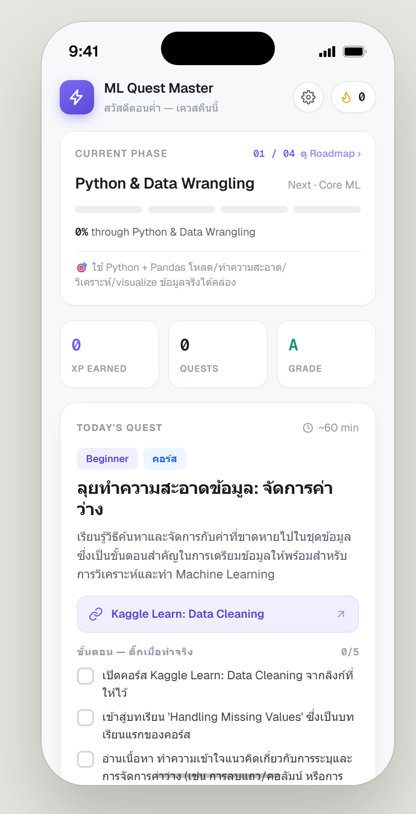
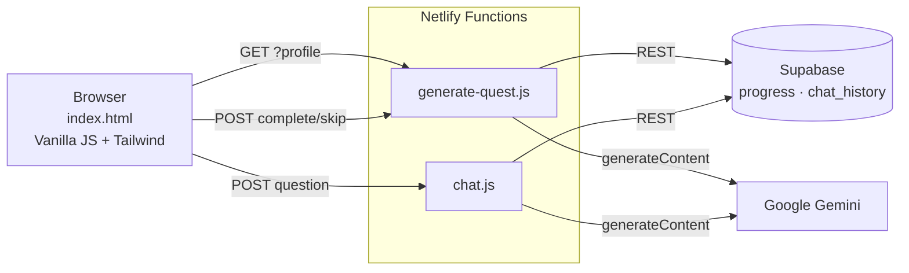

<div align="center">

# ⚡ ML Quest Master

**An AI-powered daily-quest app that turns learning Machine Learning into a guided, gamified journey.**

Every day the app generates a single, actionable quest tailored to your level and position on a Kaggle-based roadmap — complete with real resource links, a step-by-step checklist, and an AI coach you can chat with in your own language. Installable as a PWA — add it to your phone's home screen and it runs full-screen like a native app.

### [🚀 Live Demo → ml-quest-master.netlify.app](https://ml-quest-master.netlify.app)

[](https://ml-quest-master.netlify.app)
[](https://ml-quest-master.netlify.app)
[](#tech-stack)
[](#tech-stack)
[](#tech-stack)
[](#tech-stack)
[](#license)

</div>

---

## 📸 Preview

A pixel-accurate, mobile-style single-screen UI (390 × 844) with a purple `#6C5CE7` theme, the Geist typeface, and a slide-up coach chat.

<div align="center">
  
</div>

> The quest, resource link, and step checklist are generated by AI from the learner's roadmap position. XP unlocks only after every step is checked.

---

## ✨ Features

- **AI quest generation** — Gemini plans the next quest from your profile, current roadmap phase, and recent history, returning strict JSON (`title`, `steps`, `resources`, `deliverable`, `verify`, `difficulty`, `xp`…).
- **Real, curated resources** — every quest links to *real* Kaggle Learn courses / competitions. URLs are whitelisted server-side so the model can never hallucinate a broken link.
- **Completion gating** — XP is only awarded after the user ticks off **every** step in the checklist, so progress reflects real work, not a single click.
- **Kaggle-based roadmap** — a 4-phase curriculum (Python & Data Wrangling → Core ML → Deep Learning → Specialize & Portfolio) with a visual timeline showing where you are.
- **Skip courses you already know** — mark completed courses; the planner skips them and the roadmap strikes them through.
- **AI Quest Coach** — a slide-up chat that answers in Thai, prefers Socratic hints over full solutions, and is aware of the current quest's context.
- **One quest per day** — after you finish (or skip) today's quest, the app locks until midnight (your timezone) and tells you when the next one unlocks — keeping the habit daily and the AI usage within the free tier.
- **Gamification** — XP, real consecutive-day streaks, completion-based phase progress (advances only as you *complete* quests, not as days pass), and a letter grade derived from your completion rate.
- **Graceful rate-limit handling** — when the AI quota is hit, the UI explains *which* quota (per-minute vs per-day) and *exactly when* access returns, converted to local time.
- **Installable PWA** — responsive full-screen layout on phones, a web manifest, app icons, and a service worker (offline app shell) so it can be added to the home screen and launched like a native app.

---

## 🏗️ Architecture



**Request flow**

1. On load, the frontend sends the locally-stored learner profile to `generate-quest`.
2. The function reads the latest `progress` rows, decides the current roadmap phase, and **reuses today's pending quest if one exists** (saving an API call) or asks Gemini to plan a new one.
3. The quest is persisted to Supabase and returned with computed `stats` and a full `roadmap`.
4. Completing/skipping a quest and chatting with the coach are separate calls that update Supabase and the UI.

---

## 🧠 Engineering Highlights

These are the decisions I'm most proud of as an engineer:

| Challenge | Solution |
|---|---|
| **LLMs hallucinate URLs** | The backend keeps an allow-list of real Kaggle URLs per phase and filters the model's `resources` against it, falling back to a known-good link. The model *cannot* emit a broken link. |
| **"XP increased before I did anything"** | Re-modeled progress: the phase % is computed from **completed quests**, not the day counter, and the *Complete* button is disabled until every checklist step is ticked. |
| **Free-tier quota limits** | Today's quest is cached as a `pending` row and reused on refresh, so reloading never burns quota. A `fresh=1` flag forces regeneration only when the profile changes. |
| **Rate-limit UX** | The 429 body is parsed to distinguish *per-minute* vs *per-day* quotas; the daily reset is computed at Pacific midnight and surfaced to the user in their local time, with a one-line model-swap escape hatch (`GEMINI_MODEL` env). |
| **Secrets never touch the client** | Status mutations are folded into the same function as generation so the Supabase key stays server-side; only public-safe data reaches the browser. `.env` is git-ignored. |
| **Resilient to schema drift** | The live database differs from the reference schema (UUID ids, integer `phase`); the code discovers and adapts to the real column types rather than assuming. |
| **Robust JSON parsing** | Gemini output is requested as `application/json` and additionally stripped of code fences / surrounding prose, then normalized & clamped (xp, time, difficulty) before use. |
| **Self-healing state** | A malformed or legacy `pending` quest is detected and regenerated automatically instead of crashing the screen. |
| **PWA correctness** | Installability bugs were debugged from production: the manifest needed an `application/manifest+json` MIME type (set via Netlify headers) and the home-screen icon required a non-blank, correctly-sized PNG — both verified against the deployed URL. |

---

## 🧰 Tech Stack

| Layer | Choice | Why |
|---|---|---|
| Frontend | **Single `index.html`** — Tailwind (CDN) + Vanilla JS | Zero build step, instant deploy, full control over the pixel-perfect mobile UI |
| Backend | **Netlify Functions** (Node 18, esbuild) | Serverless, no server to run, keeps API keys off the client |
| Database | **Supabase** (Postgres + REST) | Free tier, instant REST API, row-level security |
| AI | **Google Gemini** (`gemini-2.5-flash`) | Fast, JSON mode, generous free tier (model is env-configurable) |
| Hosting | **Netlify** | Git-based deploys, native function support via `netlify.toml` |

---

## 🗂️ Project Structure

```
ml-quest/
├── index.html                      # Entire frontend (UI + state + API calls)
├── netlify.toml                    # Functions config + /netlify/functions/* redirect
├── supabase-schema.sql             # Tables, indexes, RLS policies
├── .env.example                    # Env var template (no secrets)
└── netlify/functions/
    ├── generate-quest.js           # Roadmap, quest generation, complete/skip, stats
    └── chat.js                     # Quest Coach (Thai, context-aware)
```

---

## 🗺️ Curriculum (Roadmap)

| Phase | Focus | Anchored on |
|---|---|---|
| 1. Python & Data Wrangling | Python, Pandas, cleaning, visualization | Kaggle Learn |
| 2. Core ML | Regression, trees, feature engineering, evaluation | Kaggle Learn + Titanic / House Prices |
| 3. Deep Learning | Neural nets, CV, NLP | Kaggle Learn + Digit Recognizer / NLP |
| 4. Specialize & Portfolio | Time series, SQL, explainability, end-to-end projects | Kaggle Datasets |

Phase boundaries and resources live in `PHASES` inside `generate-quest.js` and are easy to extend.

---

## 🚀 Getting Started

### Prerequisites
- A [Supabase](https://supabase.com) project
- A [Google Gemini API key](https://aistudio.google.com/app/apikey)
- [Netlify CLI](https://docs.netlify.com/cli/get-started/): `npm i -g netlify-cli`

### 1. Database
Open the Supabase **SQL Editor** and run [`supabase-schema.sql`](supabase-schema.sql).

### 2. Environment variables
Copy `.env.example` to `.env` and fill in:
```bash
GEMINI_API_KEY=...
SUPABASE_URL=https://xxxx.supabase.co
SUPABASE_ANON_KEY=...
# optional: GEMINI_MODEL=gemini-2.5-flash-lite
```

### 3. Run locally
```bash
netlify dev
# → http://localhost:8888
```

### 4. Deploy
Import the repo on Netlify (it reads `netlify.toml` automatically), then add the three environment variables under **Site settings → Environment variables**.

---

## 🔌 API

### `GET /netlify/functions/generate-quest`
Returns today's quest (reused if pending, else freshly generated), plus `day`, `phase`, `roadmap`, `profile`, and `stats`. Accepts the profile as query params (`level`, `goal`, `time`, `style`, `done`, `fresh`).

### `POST /netlify/functions/generate-quest`
`{ action: "complete" | "skip", progressId }` → updates status (+XP on complete) and returns fresh `stats`.

### `POST /netlify/functions/chat`
`{ question, questContext, history, progressId }` → a Thai, context-aware coach reply; the exchange is stored in `chat_history`.

---

## 🗃️ Data Model

```sql
progress(id, day, phase, topic, quest_text, status, xp, created_at)
chat_history(id, progress_id, role, message, created_at)
```
`quest_text` stores the full quest JSON; `status` is `pending | done | skip`.

---

## License

[MIT](LICENSE) — built as a learning & portfolio project.

<div align="center">
<sub>Built with Vanilla JS, Netlify Functions, Supabase, and Google Gemini.</sub>
</div>
